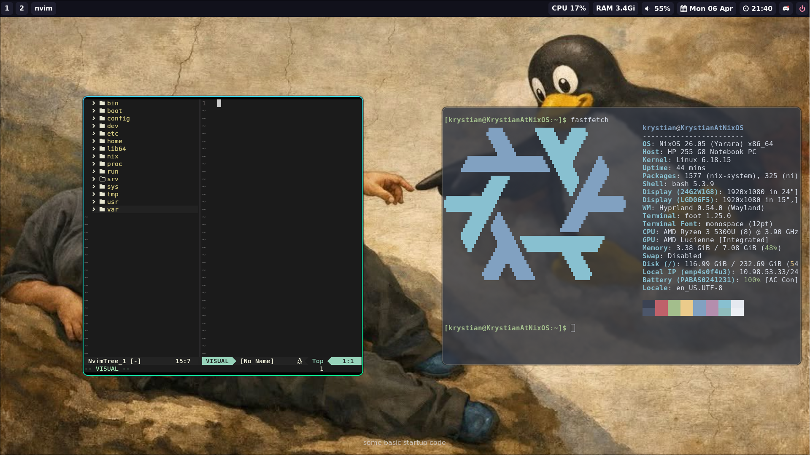

My configuration for **NixOS** using Flakes and Home Manager

## Main components
* **OS**: NixOs
* **WM**: Hyprland
* **Terminal**: Foot
* **Text editor**: Neovim
* **Shell**: Bash
* **Top bar**: Waybar

